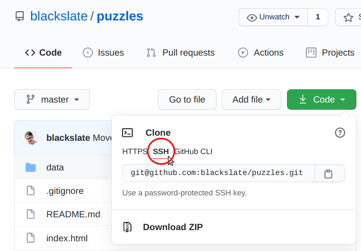
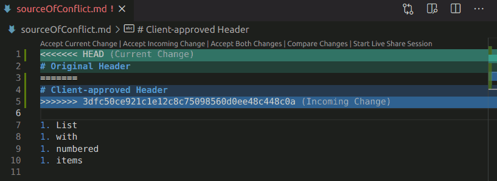

# Using `git` and GitHub effectively

## Difference between `git` and GitHub
### `git`
* `git` is a program created by Linus Torvald
* It's a Version Control System
* It tracks the progress of your project
* It allows you to save your project in different states of completion
* It allows you to maintain several _repositories_ of your project files in different places.
* `git` is free

### GitHub
* GitHub is one of the places where you can store a repository.
* GitHub provides a wide range of services like
  * Issues
  * A wiki
  * GitHub pages
  * Project organisation
  * Continuous Integration and other actions,
* GitHub is a for-profit service (with a free layer)...
* ... with unlimited private repositories for unlimited users in an organization, who can be organized in teams.

### Alternatives to GitHub
* [BitBucket](https://bitbucket.org/product) by Atlassian, who also provide integration with Jira, HipChat, Trello and Confluence. Free for teams of up to 5 members and for community projects.
* [GitLab](https://about.gitlab.com/), host to GNOME and GIMP. Free for individual users.
* [More](https://itsfoss.com/github-alternatives/)

---
# Why Use `git`?
1. The bottom line: **prospective employers will look at your activity with Git before they decide whether to contact you or not.**
2. Web development is team work. Team work is communication. You need to let your team members know what tasks you have taken care of. For this you can use:
   * Commit messages
   * Forks
   * Branches
   * Pull Requests + Merging
3. Web development is pioneering work. You need to explore different solutions (often in the wrong direction), to make mistakes without breaking things. For this, you can use three or more branches for each project:
   * main
   * dev
   * current-feature
   Plus others as needed:
   * bug-fix
   * proof-of-concept
   * ...

---
# User Experience

**Tell me how you have been using `git` and GitHub**

* How do you organize your project folders?
* Have you been working with branches?
* How much experience do you have with merging branches?

---
# Ease of Use

<h2 id="config">Configure git</h2>
Before you can use `git` you must tell git who you are and where to contact you, so that your contributions to other repositories can be credited to (or blamed on) you.

- `git config --global user.name "Your Name"`
- `git config --global user.email "your_email@domain.com"`

<h2 id="commit"><a href="https://stackoverflow.com/a/36644561/1927589">Set VS Code to be default editor for `commit`</a></h2>

  * Check `code --help` works
  * (See this [Stack Overflow answer](https://stackoverflow.com/a/36644561/1927589) if not)
  * `git config --global core.editor "code --wait"`

<h2 id="ssh"><a href="https://docs.github.com/en/github/authenticating-to-github/connecting-to-github-with-ssh">Connect to GitHub with SSH</a></h2>

1. [Create an SSH public and private key pair](https://docs.github.com/en/github/authenticating-to-github/connecting-to-github-with-ssh/generating-a-new-ssh-key-and-adding-it-to-the-ssh-agent#generating-a-new-ssh-key) (or use an existing one)
2. Copy the text of the *public* key (probably `~/.ssh/id_rsa.pub`)
3. Visit your [SSH and GPG Keys](https://github.com/settings/keys) page in your [GitHub Settings](https://github.com/settings/).
4. Click on the green [Add SSH Key](https://github.com/settings/ssh/new) button
5. Paste your public key and give it a title (e.g.: DCI Laptop) so that you can easily find it again and delete when you no longer need it.
6. From now on, when you want to clone a repository, you will be able to use the **SSH** tab that appears when you click on the green Code button on GitHub.


---
# Using `git`

## Getting started
  + Create a directory on your work computer
    - **Organize your file hierarchy** so that you can be sure that each project directory is in its own personal space
    - Use Bookmarks
    - Use Folder colours
  + Use `git init` to start tracking changes
  + Create a README.md file to describe the project
  + Create a repository on GitHub
  + Make a first commit, to create a `master` branch
  + Link your local repository to the GitHub repository. This will:
    - Add a remote repository URL called "origin" to your local repository
    - Change the name of your principal branch to `main`
    -


## Create a `dev` and feature branches
  + `git checkout -b dev`
  + Decide what feature you are going to work on
  + Create a specific branch for this feature
  + Give it a self-explanatory name
  + Work on this feature branch
### Why?
  * Development is all about modules: about breaking problems into smaller problems.
  * Keep your work in neatly organized blocks
  * Construct your project from blocks that you can take apart and put back together again
  * Create modular blocks — black boxes — that can be fixed, updated, replaced independently of each other.

## Basic workflow
**Each time you reach a stable point:**
  + Check the status with `git status`
    This shows you:
    - Which files have been added
    - Which files have been deleted
    - Which files have been modified
  + Stage files with `git add <path/to/file>`
  + Use the `.` shortcut to add all files
  + Create a commit with `git commit`
  + Write a detailed message
    - For your team mates
    - For your future self
    - As detailed as possible, so you feel good about the quality of work that you have done.
    - **This is what your future employers will be looking at**
  + View the history with `git log`
  + Quick commits with `git commit -am <message>`
  + [Create a `gmit` alias](https://dciforks.github.io/nav-menu-2/)

## Branches

* Create a branch from the current branch
  `git checkout -b <new-branch-name>`
* Create a branch from the current  main branch
  `git checkout -b <new-branch-name> main`
* Create a branch from another branch
  `git checkout -b <new-branch-name> <other-branch-name>`
* Rename a branch
  `git branch -M <new-name>`
* Delete a branch
  `git branch -d <name-of-branch-to-delete>`
* View info about branches
  `git branch -v`

## Pull Requests
* Automatically created when you push a feature branch to GitHub
* Visit GitHub and click on green Compare & Pull Request button
* Edit PR message
* Click on green Create Pull Request button
* **DON'T click on the Merge Pull Request button**
* Click on the  view `command line instructions` link

## Merging and Merge Conflicts
* Get the name of the PR branch
* Create a new branch locally with the name of the PR branch, based on an existing branch. For example:
  `git checkout -b <pr-branch-name> <dev>`
* snth
  `git pull https://github.com/<team-member>/<repository> <branch-name>`
* Resolve any conflicts
  
* Commit the changes
* ```
  git checkout dev
  git merge --no-ff <branch-name>
  git push origin dev
  ```
---
# Working as a team

## Who has the right to merge?
* Just project owner
  + All team members should fork the repository and clone that
  + Create `upstream` origin

* All team members
  + Clone the main repository (`origin`)

## Working on a feature
  + Create a specific branch for each feature
  + Commit changes
  + Create a detailed commit message
  + Push the branch to the GitHub repository
  + Create a Pull Request
  + Discuss the PR with others before merging

## Pulling a branch

* `git pull <source> main`
  - Merges local `main` with the shared (authoratitive) `main`
  - May require resolving a merge conflict: accept all incoming
* `git checkout <feature-branch>`
* `git merge main`
  - May require resolving a merge conflict: select which new code to use

---
# Resources

* [Collaborating with pull requests](https://docs.github.com/en/github/collaborating-with-pull-requests)
